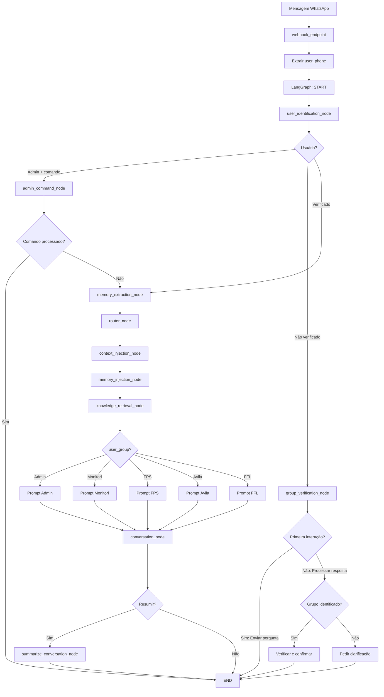

# Arquitetura do Sistema Multi-Tenant

## Diagrama de Fluxo



## Estrutura de Grupos

```
┌─────────────────────────────────────────────────┐
│           AI COMPANION MULTI-TENANT             │
└─────────────────────────────────────────────────┘
                      │
        ┌─────────────┼─────────────┐
        │             │             │
    ┌───▼───┐    ┌────▼────┐   ┌───▼────┐
    │ ADMIN │    │ CLIENTS │   │  DEMO  │
    └───┬───┘    └────┬────┘   └───┬────┘
        │             │             │
        │        ┌────┴────┐        │
        │        │         │        │
    ┌───▼───┐  ┌─▼──┐  ┌──▼─┐  ┌───▼────┐
    │ Fred  │  │Mon.│  │FPS │  │  Ávila │
    │+55119 │  │    │  │    │  │ Digital│
    │91668  │  └────┘  └────┘  └────────┘
    │852    │      │      │         │
    └───────┘      │      │         │
        │          │      │         │
    Full Access    │      │    ┌────▼────┐
        │          │      │    │   FFL   │
        │       Data   Medical │Aviation │
        │      Analysis Cases  │ Manuals │
        │          │      │    └─────────┘
    Commands    Mitto  Calendar
     Stats      APIs   Clinical
    Prompts           Cases
    Config
```

## Fluxo de Verificação

```
┌──────────────────────────────────────────────────┐
│  NOVA MENSAGEM DE NÚMERO DESCONHECIDO           │
└───────────────┬──────────────────────────────────┘
                │
                ▼
    ┌───────────────────────┐
    │ Criar registro user   │
    │ group = unverified    │
    │ verified = false      │
    └───────────┬───────────┘
                │
                ▼
    ┌───────────────────────┐
    │ Enviar pergunta de    │
    │ identificação (1-4)   │
    └───────────┬───────────┘
                │
                ▼
    ┌───────────────────────┐
    │ Aguardar resposta     │
    └───────────┬───────────┘
                │
                ▼
    ┌───────────────────────┐
    │ Processar escolha     │
    │ (1=Mon, 2=FPS, etc)   │
    └───────────┬───────────┘
                │
                ▼
    ┌───────────────────────┐
    │ Atualizar DB:         │
    │ group = escolhido     │
    │ verified = true       │
    └───────────┬───────────┘
                │
                ▼
    ┌───────────────────────┐
    │ Enviar confirmação    │
    │ e ativar features     │
    └───────────────────────┘
```

## Componentes do Sistema

### 1. User Management Layer
```
┌────────────────────────────────────┐
│      UserManager (SQLite)          │
├────────────────────────────────────┤
│ • get_user(phone)                  │
│ • create_user(phone, admin)        │
│ • verify_user(phone, group)        │
│ • increment_message_count()        │
│ • get_user_stats()                 │
│ • log_interaction()                │
└────────────────────────────────────┘
```

### 2. Admin Layer
```
┌────────────────────────────────────┐
│      AdminCommands                 │
├────────────────────────────────────┤
│ • parse_command(message)           │
│ • execute_command(cmd, params)     │
│ • _get_stats()                     │
│ • _set_prompt(group, prompt)       │
│ • _get_prompt(group)               │
│ • _set_config(key, value)          │
│ • get_custom_prompt(group)         │
└────────────────────────────────────┘
```

### 3. Prompt Selection Layer
```
┌────────────────────────────────────┐
│   get_character_response_chain()   │
├────────────────────────────────────┤
│ Input: user_group                  │
│        knowledge_context           │
│        memory_context              │
│        current_activity            │
│                                    │
│ Process:                           │
│ 1. Select prompt by group          │
│ 2. Check custom prompts            │
│ 3. Inject contexts                 │
│ 4. Build chain                     │
│                                    │
│ Output: Configured LLM chain       │
└────────────────────────────────────┘
```

### 4. Knowledge Retrieval Layer
```
┌────────────────────────────────────┐
│   Group-Specific Knowledge         │
├────────────────────────────────────┤
│ FFL:      → Aviation Manuals       │
│ FPS:      → Clinical Cases         │
│ Monitori: → Data Schemas           │
│ Ávila:    → Demo Scripts           │
│ Admin:    → System Docs            │
└────────────────────────────────────┘
```

## Banco de Dados

### Estrutura de Tabelas

```sql
-- Users Table
CREATE TABLE users (
    phone_number TEXT PRIMARY KEY,
    user_group TEXT NOT NULL,
    verified INTEGER NOT NULL,
    first_interaction TEXT NOT NULL,
    last_interaction TEXT NOT NULL,
    message_count INTEGER DEFAULT 0,
    metadata TEXT
);

-- Interaction Log Table
CREATE TABLE interaction_log (
    id INTEGER PRIMARY KEY AUTOINCREMENT,
    phone_number TEXT NOT NULL,
    timestamp TEXT NOT NULL,
    message_type TEXT,
    FOREIGN KEY (phone_number) REFERENCES users(phone_number)
);
```

### Exemplo de Registros

```
users:
+-------------------+------------+----------+----------------------+
| phone_number      | user_group | verified | message_count        |
+-------------------+------------+----------+----------------------+
| +5511991668852    | admin      | 1        | 156                  |
| +5511999887766    | monitori   | 1        | 23                   |
| +5581988776655    | fps        | 1        | 45                   |
| +5511977665544    | avila      | 1        | 12                   |
| +5511966554433    | ffl        | 1        | 89                   |
+-------------------+------------+----------+----------------------+
```

## Estados do Grafo

```python
AICompanionState:
    # Original fields
    messages: List[Message]
    summary: str
    workflow: str
    memory_context: str
    knowledge_context: str
    
    # NEW: User management fields
    user_phone: Optional[str]
    user_group: Optional[str]
    is_first_interaction: bool
    user_verified: bool
    awaiting_verification: bool
```

## Segurança e Isolamento

```
┌─────────────────────────────────────────┐
│           Security Layer                │
├─────────────────────────────────────────┤
│                                         │
│  Phone Number Verification              │
│         │                               │
│         ▼                               │
│  Group Assignment                       │
│         │                               │
│         ▼                               │
│  Permission Check                       │
│         │                               │
│         ├─► Admin: ALL                  │
│         ├─► Monitori: Data only         │
│         ├─► FPS: Med content only       │
│         ├─► Ávila: Demo only            │
│         └─► FFL: Aviation only          │
│                                         │
└─────────────────────────────────────────┘
```
